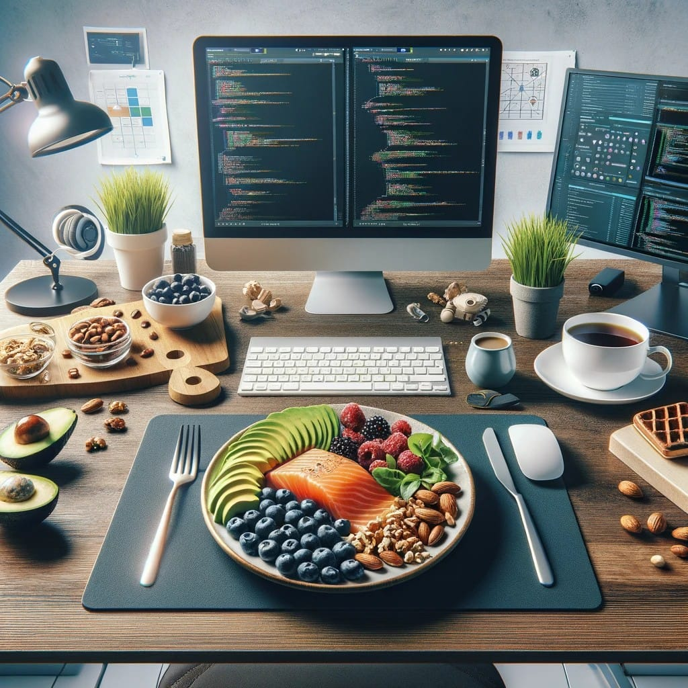

# Grilled Salmon Quinoa Bowl with Avocado and Vegetables

## Ingredients:

### Grilled Salmon:
- 2 salmon fillets
- Olive oil
- Lemon juice
- Salt and pepper to taste

### Quinoa:
- 1 cup quinoa
- 2 cups water or vegetable broth
- Salt to taste

### Vegetables:
- 1 cup cherry tomatoes, halved
- 1 cucumber, diced
- 1 bell pepper, thinly sliced
- 1 cup baby spinach or kale

### Avocado Dressing:
- 1 ripe avocado
- 2 tablespoons Greek yogurt
- 1 clove garlic, minced
- 1 tablespoon lime or lemon juice
- Salt and pepper to taste

## Instructions:

1. **Prepare Quinoa:**
   - Rinse quinoa under cold water. Combine quinoa, water or broth, and a pinch of salt in a saucepan. Bring to a boil, then reduce heat, cover, and simmer until quinoa is cooked and water is absorbed. Fluff with a fork.

2. **Grill Salmon:**
   - Preheat the grill. Rub salmon fillets with olive oil, lemon juice, salt, and pepper. Grill for about 3-4 minutes per side or until cooked through.

3. **Prepare Vegetables:**
   - While the salmon is grilling, prepare the vegetables. Toss cherry tomatoes, cucumber, bell pepper, and baby spinach or kale in a bowl.

4. **Make Avocado Dressing:**
   - In a blender, combine avocado, Greek yogurt, minced garlic, lime or lemon juice, salt, and pepper. Blend until smooth.

5. **Assemble the Bowl:**
   - Divide the cooked quinoa among serving bowls.
   - Top with grilled salmon and mixed vegetables.
   - Drizzle the avocado dressing over the bowl.

6. **Garnish and Serve:**
   - Optionally, garnish with fresh herbs like cilantro or parsley.
   - Serve immediately, and enjoy a nutritious and satisfying meal.

**Why This Meal?**
- *Salmon:* Rich in omega-3 fatty acids for brain health.
- *Quinoa:* High in protein and complex carbohydrates for sustained energy.
- *Vegetables:* Provide essential vitamins and minerals.
- *Avocado:* Healthy fats for brain function.
- *Greek Yogurt:* Adds protein and creaminess to the dressing.
