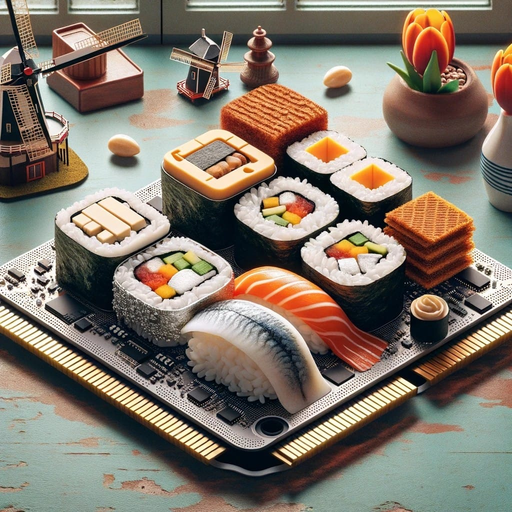

# Dutch-Inspired Sushi Rolls

## Ingredients:

### For the Sushi Rice:
- 2 cups sushi rice
- 2 1/2 cups water
- 1/2 cup rice vinegar
- 2 tablespoons sugar
- 1 teaspoon salt
- 1 cup of pepper chili

### For the Filling:
- Smoked eel fillets, thinly sliced
- Gouda cheese, cut into thin strips
- Avocado, sliced
- Cucumber, julienned
- Pickled herring strips
- Dutch mayonnaise for dipping

### For Rolling:
- Nori (seaweed) sheets
- Soy sauce for serving
- Wasabi and pickled ginger for serving

## Instructions:

1. **Prepare Sushi Rice:**
   - Rinse the sushi rice under cold water until the water runs clear.
   - Combine rice and water in a rice cooker and cook according to the manufacturer's instructions.
   - In a small saucepan, heat rice vinegar, sugar, and salt until the sugar and salt dissolve. Allow it to cool.
   - Once the rice is cooked, transfer it to a large bowl. Gradually add the vinegar mixture, gently folding it into the rice. Allow the rice to cool to room temperature.

2. **Assemble Ingredients:**
   - Lay a bamboo sushi rolling mat on a clean surface.
   - Place a sheet of nori, shiny side down, on the rolling mat.

3. **Create the Sushi Roll:**
   - Wet your hands to prevent the rice from sticking. Spread a thin layer of sushi rice over the nori, leaving a small border at the top.
   - Arrange slices of smoked eel, Gouda cheese, avocado, cucumber, and pickled herring along the bottom edge of the nori.

4. **Roll the Sushi:**
   - Carefully lift the edge of the bamboo mat closest to you and start rolling the sushi away from you, using the mat to shape it into a tight cylinder.

5. **Slice and Serve:**
   - Use a sharp knife to slice the sushi roll into bite-sized pieces.
   - Repeat the process with the remaining ingredients.

6. **Serve with Dutch Mayo:**
   - Arrange the sushi on a plate and serve with Dutch mayonnaise on the side for dipping.

7. **Enjoy:**
   - Serve the Dutch-inspired sushi rolls with soy sauce, wasabi, and pickled ginger. Enjoy your unique twist on sushi!
